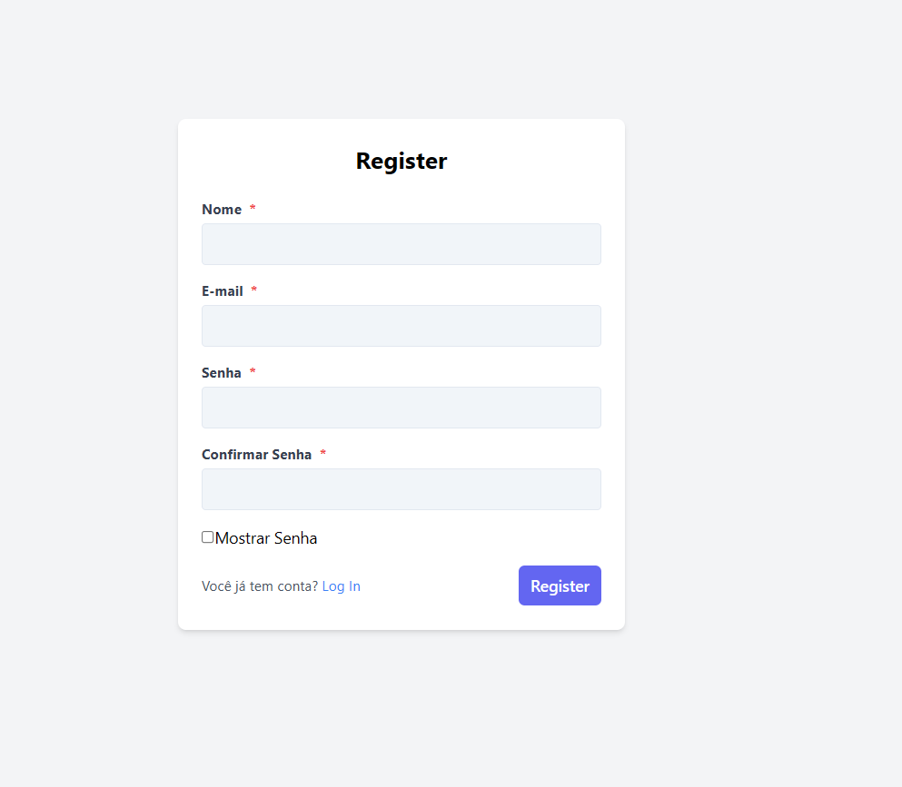
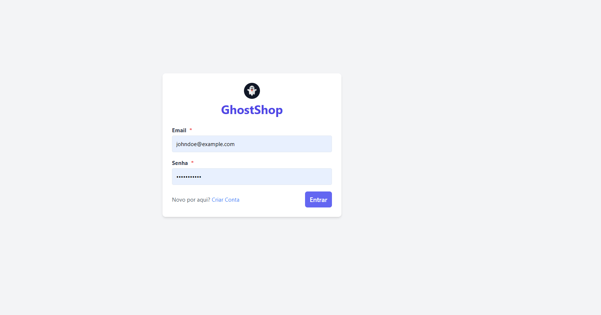
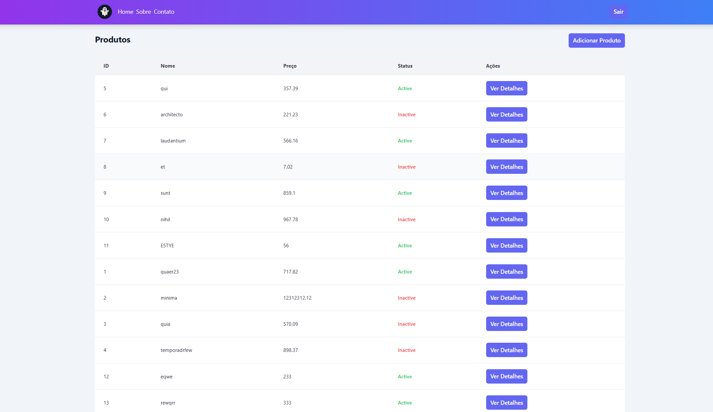

# Projeto: **challenge-fullstack**

Este é um projeto **full-stack** utilizando **Laravel** no backend e **React** no frontend. O ambiente de desenvolvimento é configurado com **Docker Sail**, que facilita a criação de um ambiente isolado e consistente para todos os desenvolvedores.

## Configuração do Ambiente

### Backend - Docker, PHP e Laravel

Para Executar o Projeto basta seguir os seguintes passos:

1. Clone o repositório do projeto para sua máquina:

``` 
git clone https://github.com/Marciellepaula/challenge-fullstack.git 
```
    
e em seguida: 

```
cd backend/
```

2. Crie uma Cópia do arquivo ```.env.example```
    
    2.1. Renomeie o arquivo para ```.env```

    2.2. Eu ja deixei o arquivo de exemplo preenchido conforme o necessário para fazer as conexões.

    Caso haja algum problema com a utilização das portas padroes do laravel, você pode sempre editar conforme necessario no seu arquivo ```.env``` e caso seja necessario no arquivo ```docker-compose.yml```

3. Na pasta raiz do repositorio execute o seguinte comando:

```
docker run --rm \
    -u "$(id -u):$(id -g)" \
    -v "$(pwd):/var/www/html" \
    -w /var/www/html \
    laravelsail/php84-composer:latest \
    composer install --ignore-platform-reqs
```
Esse comando vai instalar as nossas dependencias do php e baixar a Imagem do Sail para executar o projeto

4. Uma vez que o comando anterior ja foi executado
vamos executar o seguinte comando para iniciar o Sail

```
./vendor/bin/sail up -d
```

Agora temos o projeto executando, mas ainda faltam alguns passos.

5. Execute para criar a chave da aplicação 

```
./vendor/bin/sail artisan key:generate
```

6. Então execute as Migrations para criar a estrutura do banco de dados

```
./vendor/bin/sail artisan migrate 
```

e em seguida executar as seeders para popular o banco 
```
./vendor/bin/sail artisan db:seed  
```

Pronto, com isso você tem a  api da aplicação pronta e rodando conforme planejado.

## Tecnologias Utilizadas

- **Docker**
- **Laravel 11**
- **PHP**

### Frontend - ReactJS, TailwindCss

Este projeto é uma Aplicação de Página Única (SPA) projetada para exibir produtos. Ele é desenvolvido com React e estilizado usando TailwindCSS. Inclui roteamento básico com React Router e usa Axios para requisições HTTP.

## Começando

Para começar a trabalhar no projeto, siga estas etapas:

### 1. Instalando dependências

a partir da pasta raiz do repositório  va para a pasta ```frontend/```

```
cd frontend
```

e em seguida instale as dependências do projeto:
```
npm install
```

feito isso basta executar o projeto

```
npm start
```

Agora o projeto ja está pronto e funcionando

## Tela Registro



## Tela login



## Tela Principal



## Detalhes do Projeto

- **Nome**: spa-products
- **Versão**: 0.1.0
- **Dependências**:
  - `axios`: "^1.7.9" — Cliente HTTP baseado em Promises para realizar requisições API.
  - `cra-template`: "1.2.0" — O template padrão utilizado para criar aplicações React.
  - `react`: "^19.0.0" — Biblioteca JavaScript para construir interfaces de usuário.
  - `react-dom`: "^19.0.0" — Serve como ponto de entrada para a aplicação web.
  - `react-router-dom`: "^7.1.1" — Roteamento declarativo para aplicações React.

- **DevDependencies**:
  - `@babel/plugin-proposal-private-property-in-object`: "^7.21.11" — Plugin Babel para suporte a propostas do JavaScript.
  - `autoprefixer`: "^10.4.20" — Plugin do PostCSS para adicionar prefixos de fornecedor ao CSS.
  - `postcss`: "^8.4.49" — Ferramenta para transformar CSS com JavaScript.
  - `react-scripts`: "^5.0.1" — Pacote do Create React App para rodar a aplicação React.
  - `tailwindcss`: "^3.4.17" — Framework CSS de utilitários para desenvolvimento rápido de interfaces.

