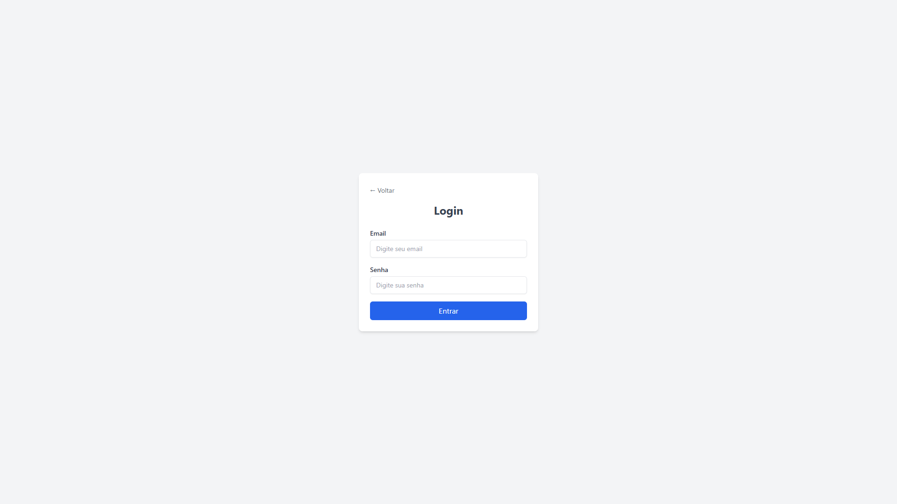
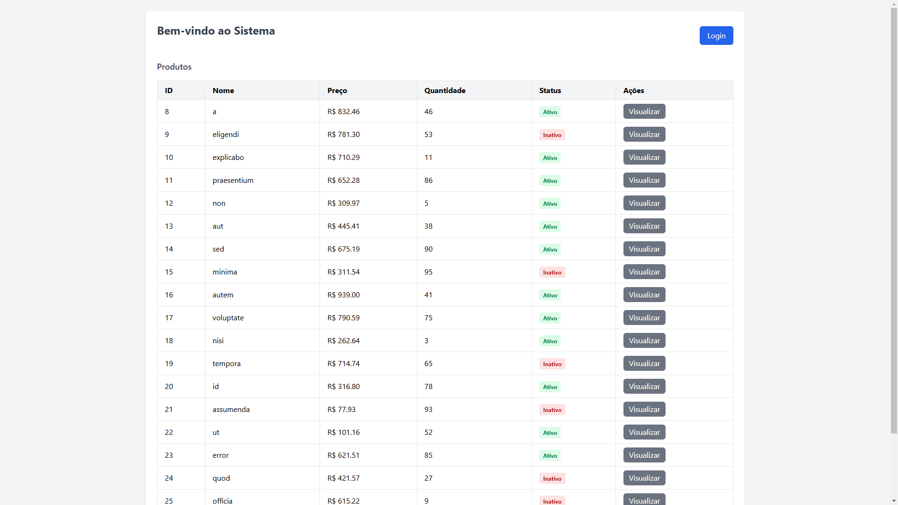
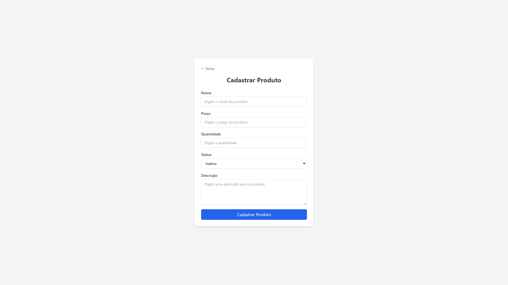
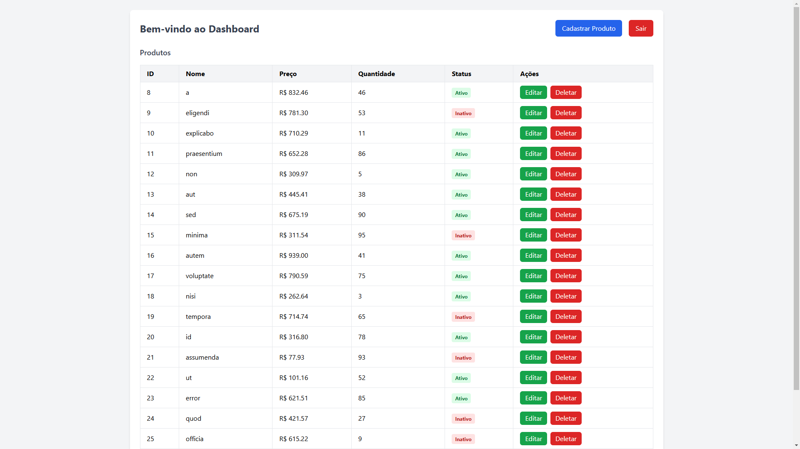
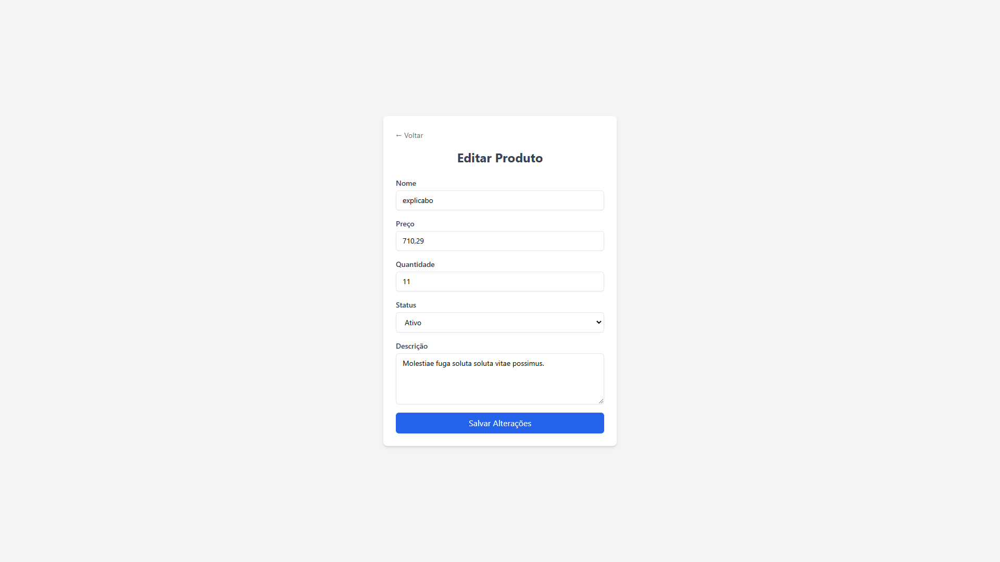
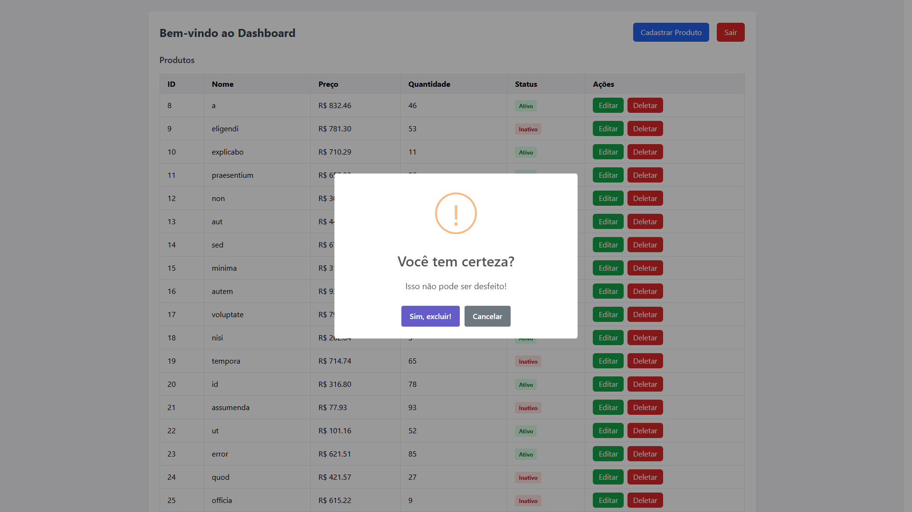

# Desafio: Cadastro de Produtos

Este repositório contém o desafio dividido em duas partes: backend (API Laravel) e frontend (SPA ReactJS). Siga os passos abaixo para instalar e executar o projeto.

---

## Tecnologias Utilizadas

### **Backend**
- **Laravel**: Framework PHP para a construção da API RESTful.
- **Composer**: Gerenciador de dependências PHP.
- **PHPUnit**: Ferramenta de testes unitários para garantir a qualidade do código.

### **Frontend**
- **ReactJS**: Biblioteca JavaScript para a construção de uma Single Page Application (SPA).
- **React Scripts**: Ferramenta para criação e execução do projeto React.
- **TailwindCSS**: Framework CSS para estilização rápida e responsiva.
- **SweetAlert2**: Biblioteca para exibição de alertas e diálogos interativos.

---

## **Rotas Disponíveis (Backend)**

<table>
  <thead>
    <tr>
      <th>Método</th>
      <th>Endpoint</th>
      <th>Descrição</th>
    </tr>
  </thead>
  <tbody>
    <tr>
      <td>GET</td>
      <td><code>/api/products</code></td>
      <td>Retorna uma lista completa de produtos disponíveis.</td>
    </tr>
    <tr>
      <td>POST</td>
      <td><code>/api/products</code></td>
      <td>Permite a criação de um novo produto (acesso restrito).</td>
    </tr>
    <tr>
      <td>GET</td>
      <td><code>/api/products/{id}</code></td>
      <td>Obtém informações detalhadas sobre um produto específico pelo ID.</td>
    </tr>
    <tr>
      <td>PUT</td>
      <td><code>/api/products/{id}</code></td>
      <td>Atualiza informações de um produto existente (acesso restrito).</td>
    </tr>
    <tr>
      <td>DELETE</td>
      <td><code>/api/products/{id}</code></td>
      <td>Exclui um produto do sistema (acesso restrito).</td>
    </tr>
    <tr>
      <td>POST</td>
      <td><code>/api/login</code></td>
      <td>Efetua o login do usuário no sistema.</td>
    </tr>
  </tbody>
</table>


## Pré-requisitos
Certifique-se de que as seguintes ferramentas estão instaladas em sua máquina: PHP >= 8.0, Composer, Node.js >= 14, NPM ou Yarn, Banco de Dados (MySQL, etc.), Git.

---

## Configuração do Backend (Laravel)

### 1. Instalação
1. Navegue até a pasta do backend: `cd backend`
2. Instale as dependências:
 ```bash
 composer install
 ```
3. Copie o que está no arquivo `.env.example` para o `.env` do projeto:
   ```bash
   cp .env.example .env
   ```
4. Gere a chave única para a aplicação:
   ```bash
   php artisan key:generate
   ```

### 2. Banco de Dados
1. Crie um banco de dados com o nome desejado.
2. Execute as migrações para criar as tabelas:
   ```bash
   php artisan migrate
   ```
3. Popule o banco de dados com dados fictícios:
   ```bash
   php artisan db:seed
   ```

### 3. Testes
Para executar os testes unitários, utilize o comando:
```bash
php artisan test
```

---

## Configuração do Frontend (ReactJS)

### 1. Instalação
1. Navegue até a pasta do frontend:
   ```bash
   cd frontend
   ```
2. Instale as dependências do projeto:
   ```bash
   npm install
   ```


---

## Como Executar
1. Inicie o servidor backend:
   ```bash
   php artisan serve
   ```
2. Inicie o servidor frontend:
   ```bash
   npm start
   ```
3. Acesse a aplicação no navegador em:
   ```
   http://127.0.0.1:3000
   ```
4. Certifique-se de que o backend e o frontend estão rodando no mesmo endereço base para evitar problemas de CORS.

---

## Login
Utilize as credenciais abaixo para acessar a aplicação:
- **Email**: test@example.com
- **Senha**: 123456

---

## Prints do Projeto







## Sobre o programador
Veja mais em: https://joaovicto.com.br
