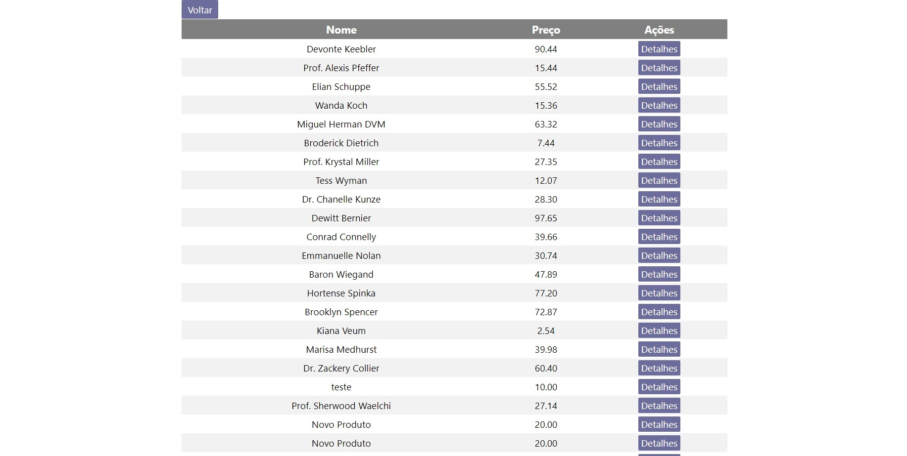
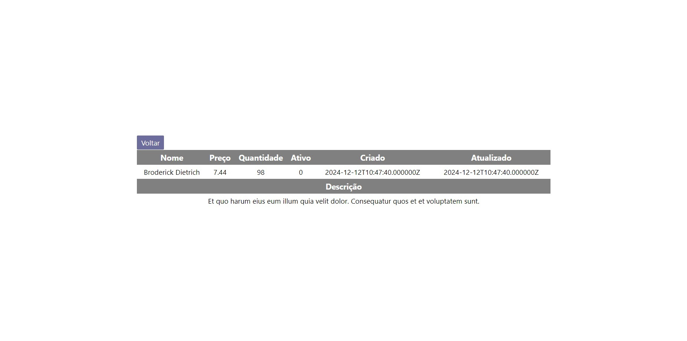

1. Ambiente
   
    O sofware foi desenvolvido com os seguintes conjuntos de ferramentas: 
    1.	Windows 10 
    2.	Laravel v10.48.25 
    3.	Xampp 
    4.	PHP 8.2.12 
    5.	MariaDB 10.4.32 6.	
    6.	VS code 
    7.	Node.js v22.12.0 
    8.	Npm 10.9.0 
 
3. Instalação
   
    Para fazer a instalação siga os seguintes passos:
    1. Faça a cópia do repositório.
    2. Se preferir instale o banco de dados já fornecido na pasta database colocando o nome do db como laravel, se        não fizer dessa forma, a instalação do banco de dados terá que ser de outra forma que não será listada aqui.
    3. Rode o comando composer install na raiz da pasta backend.
    4. Crie um arquivo chamado .env na raiz da pasta backend.
    5. Copie o conteúdo do arquivo .env.example para o arquivo .env.
    6. Rode o comando php artisan key:generate no CLI na raiz da pasta backend.
    7. Na raiz da pasta frontend no CLI rode o comando npm install.
 
5. Iniciação do software
   
     Para iniciar o software execute os seguintes comandos no CLI na raiz:
   
     Pasta: backend   
     Comando: php artisan serve 
      
     Pasta: frontend  
     Comando: npm start  
      
     Para navegar no software acesse a URL: 
     http://localhost:3000 
      
     Há três páginas no programa:
   
         1.	Home:  
               Acessada por: http://localhost:3000/
               Ver Figura 3.1 presente na última seção 6. Imagens. 
         
         2.	Lista de produtos:  
               Acessada por: http://localhost:3000/api/products
               Ver Figura 3.2 presente na última seção 6. Imagens. 
         
         3.	Descrição do produto:  
               Acessada por: http://localhost:3000/api/products/{id}
               Ver Figura 3.3 presente na última seção 6. Imagens. 
 
4. Rotas e Controladores
   
    Há 7 rotas de API criadas: 
    
    Obs: Todas elas foram testadas usando o software Postman. 
     
        1./api/register 
        Função: Registrar usuário.
        Exemplo de URL utilizada: http://127.0.0.1:8000/api/register
        Método: POST. 
        Body:  
        { 
            "name": "teste", 
            "email": "teste@teste.com", 
            "password": "testeteste", 
            "password_confirmation": "testeteste"  
        } 
        
        2./api/login 
        Função: Logar usuário. 
        Exemplo de URL utilizada: http://127.0.0.1:8000/api/login
        Método: POST. 
        Body:  
        { 
            "email": "teste@teste.com", 
            "password": "testeteste" 
        } 
        Resposta exemplo: 
        { 
            "token": "2|N7Zaogt8deyTcwVHiJMVwCg6wsCJXKLgHanMLtLm5832cdd4" 
        } 
        
        3./api/products 
        Função: Listar todos os produtos. 
        Exemplo de URL utilizada: http://127.0.0.1:8000/api/products 
        Método: GET. 
        Resposta exemplo:  
        [ 
            { 
                "id": 1, 
                "name": "Devonte Keebler", 
                "description": "Nostrum natus et nam eum modi quisquam numquam. Quasi necessitatibus qui debitis error. Itaque voluptate provident explicabo. Ut cum ducimus quia voluptatem ut quia.", 
                "price": "90.44", 
                "quantity": 19, 
                "active": 0, 
                "created_at": "2024-12-12T10:47:40.000000Z", 
                "updated_at": "2024-12-12T10:47:40.000000Z" 
            }, 
            { 
                "id": 2, 
                "name": "Prof. Alexis Pfeffer", 
                "description": "Odit recusandae aut facilis nisi a autem. Autem distinctio totam vel sequi id.
        Aliquid tempore nihil eos totam minima excepturi.", 
                "price": "15.44", 
                "quantity": 27, 
                "active": 0, 
                "created_at": "2024-12-12T10:47:40.000000Z", 
                "updated_at": "2024-12-12T10:47:40.000000Z" 
            } 
        ]
    
        4./api/products/{id} 
        Função:Listar o produto do {id}. 
        Exemplo de URL utilizada: http://127.0.0.1:8000/api/products/{id}
        Método: GET. 
        Resposta exemplo:  
        { 
                "id": 1, 
                "name": "Devonte Keebler", 
                "description": "Nostrum natus et nam eum modi quisquam numquam. Quasi necessitatibus qui debitis error. Itaque voluptate provident explicabo. Ut cum ducimus quia voluptatem ut quia.", 
                "price": "90.44", 
                "quantity": 19, 
                "active": 0, 
                "created_at": "2024-12-12T10:47:40.000000Z", 
                "updated_at": "2024-12-12T10:47:40.000000Z" 
        } 
    
        5./api/products 
        Função: Cadastrar produto. 
        Exemplo de URL utilizada: http://127.0.0.1:8000/api/products
        Método: POST. 
        Autenticação: Deve-se usar o token gerado na resposta da API de login como bearer token Body:  
        { 
            "name": "teste", 
            "description": "Description", 
            "price": "10", 
            "quantity": "5" 
        } 
        
        Resposta exemplo: 
        { 
            "name": "teste", 
            "description": "Description", 
            "price": "10", 
            "quantity": "5", 
            "updated_at": "2024-12-12T13:35:27.000000Z", 
            "created_at": "2024-12-12T13:35:27.000000Z", 
            "id": 25 
        } 
        
        6./api/products/{id} 
        Função: Atualizar  produto. 
        Exemplo de URL utilizada: http://127.0.0.1:8000/api/products/{id}
        Método: PUT. 
        Autenticação: Deve-se usar o token gerado na resposta da API de login como bearer token Body:  
        {  
            "name": "teste",  
            "description": "Description",  
            "price": "10",  
            "quantity": "5"  
        }  
        
        Resposta exemplo: 
        { 
            "id": 19, 
            "name": "teste", 
            "description": "Description", 
            "price": "10", 
            "quantity": "5", 
            "active": 1, 
            "created_at": "2024-12-12T10:47:40.000000Z", 
            "updated_at": "2024-12-12T13:39:46.000000Z" 
        } 
        
        7./api/products/{id} 
        Exemplo de URL utilizada: http://127.0.0.1:8000/api/products/{id} 
        Método: DELETE. 
        Autenticação: Deve-se usar o token gerado na resposta da API de login como bearer token Resposta exemplo: 
        { 
            "message": "Product deleted successfully" 
        } 
 
6. Testes unitários 
Para rodar o teste unitário execute o comando no CLI: 
Pasta: backend 
Comando: ./vendor/bin/phpunit tests/feature/ProductControllerTest.php 
 
8. Imagens
   
     Figura 3.1: Home.   
 
                                                                          
     Figura 3.2: Lista de produtos. 
  
                                                                           
      Figura 3.3: Descrição do produto. 
  
                                                                          
 

